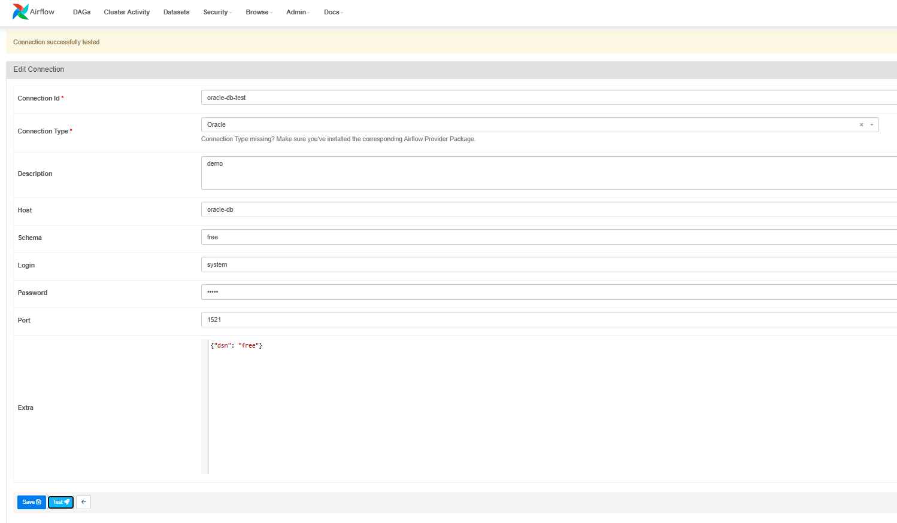

# Configuración de Apache Airflow 

> Instrucciones para configurar Apache Airflow con Docker y Oracle

## Instrucciones para arrancar airflow

1. Clonar el repositorio
2. Crear un volumen para persistir los datos de postgres: `docker volume create postgres_data_airflow`
3. Levantar los servicios con docker-compose: `docker-compose up -d`
4. Acceder a la interfaz web de airflow: `http://localhost:8080`
	* Usuario: admin
	* Contraseña: admin


## Instrucciones para configurar Docker

1. Instalar Docker
2. Instalar Docker Compose
3. Configurar permisos para el usuario actual
4. Crear un volumen para persistir los datos de postgres: `docker volume create postgres_data_airflow`
5. Crear un network para los servicios: `docker network create app-network`
6. Crear contenedores para postgres, webserver y scheduler: `docker-compose up -d`
   
- despues de editar el archivo airflow.cfg: `docker-compose restart webserver scheduler`

- iniciar el contenedor webserver: `docker exec -it --user root airflow-webserver-1 bash`

- permite finalizar los contenedores: `docker-compose down`

- permite levantar los contenedores: `docker-compose up -d`
  

### enviar archivos a contenedor:

- copiar el archivo de local al contenedor: `docker cp instantclient-sqlplus-linux.x64-21.17.0.0.0dbru.zip airflow-scheduler-1:/opt/oracle/`


### comandos pruebas de conexion

- ping entre contenedores
  
```bash
docker exec -it airflow-webserver-1 ping oracle-free

docker exec -it airflow-webserver-1 nc -zv oracle-free 1521
```


- testear conexion con sqlplus

```bash

sqlplus -v

sqlplus system/zayro@oracle-db:1521/free
```


## Instrucciones para preparar el entorno python

```bash
python -m pip install --upgrade pip
pip install --upgrade pip setuptools wheel
pip install --upgrade apache-airflow
pip install --upgrade apache-airflow-providers-common-sql
pip install cx_Oracle
pip install apache-airflow-providers-oracle
pip install -r /requirements.txt

#pip install 'apache-airflow-providers-common-sql==1.24.0'
```

## test conexion oracle

- docker exec -it airflow-webserver-1 airflow config get-value webserver allow_testing_connections

- airflow config get-value webserver allow_testing_connections




## configuracion de variables de entorno

se declaran esas variables de entorno en el archivo ~/.bashrc


```bash
echo 'export ORACLE_HOME=/opt/oracle/instantclient_21_17' >> ~/.bashrc
echo 'export LD_LIBRARY_PATH=$ORACLE_HOME' >> ~/.bashrc
echo 'export PATH=$ORACLE_HOME:$PATH' >> ~/.bashrc
echo 'export LD_LIBRARY_PATH=/opt/oracle/instantclient_21_17' >> ~/.bashrc
echo 'export PATH=$PATH:/opt/oracle/instantclient_21_17' >> ~/.bashrc
echo 'export TNS_ADMIN=$ORACLE_HOME/network/admin' >> ~/.bashrc
source ~/.bashrc
```


## airflow commands


- testear api si esta disponible: `curl -X GET "http://localhost:8080/api/v1/health" `

- agregar conexion por defecto con cli: `airflow connections add oracle_default --conn-type oracle --conn-login system --conn-password zayro --conn-host oracle-db --conn-port 1521 --conn-schema free`

- testear conexion por defecto con cli: `airflow connections test oracle_default`

-  listar dags: `airflow dags list`

-  ejecutar dag con cli: `airflow dags trigger -e 2022-01-01 example_bash_operator`
-  
-  agregar permiso para pruebas de conexion: `airflow config get-value webserver allow_testing_connections`

## configuracion airflow.cfg

-  permite autenticacion basica desde cli o api: `auth_backends = airflow.api.auth.backend.basic_auth`

- permite pruebas de conexion desde la web: `allow_testing_connections = True`
