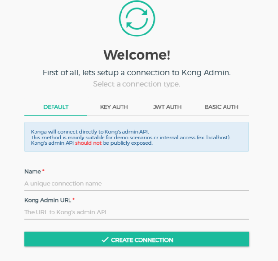

# Configuración Previa: Docker Compose con Kong

A continuación, se describe cómo configurar un entorno básico utilizando Docker Compose para Kong Gateway.

## Requisitos Previos

1. **Docker**: Asegúrate de tener Docker instalado en tu sistema.
2. **Docker Compose**: Verifica que Docker Compose esté disponible.

## Archivo `docker-compose.yml`

Crea un archivo `docker-compose.yml` con el siguiente contenido:

```yaml
version: '3.8'

services:
    kong-database:
        image: postgres:13
        container_name: kong-database
        environment:
            POSTGRES_USER: kong
            POSTGRES_DB: kong
            POSTGRES_PASSWORD: kong
        ports:
            - "5432:5432"

    kong:
        image: kong:latest
        container_name: kong
        depends_on:
            - kong-database
        environment:
            KONG_DATABASE: postgres
            KONG_PG_HOST: kong-database
            KONG_PG_USER: kong
            KONG_PG_PASSWORD: kong
            KONG_PROXY_ACCESS_LOG: /dev/stdout
            KONG_ADMIN_ACCESS_LOG: /dev/stdout
            KONG_PROXY_ERROR_LOG: /dev/stderr
            KONG_ADMIN_ERROR_LOG: /dev/stderr
            KONG_ADMIN_LISTEN: 0.0.0.0:8001
        ports:
            - "8000:8000"
            - "8001:8001"
        restart: always

    konga:
        image: pantsel/konga:latest
        container_name: konga
        depends_on:
            - kong
        environment:
            DB_ADAPTER: postgres
            DB_HOST: kong-database
            DB_USER: kong
            DB_PASSWORD: kong
            DB_DATABASE: kong
        ports:
            - "1337:1337"
        restart: always
```

## Pasos para Iniciar

1. **Inicializar la Base de Datos**:
     Ejecuta el siguiente comando para preparar la base de datos de Kong:
     ```bash
     docker run --rm \
         --network=host \
         -e "KONG_DATABASE=postgres" \
         -e "KONG_PG_HOST=localhost" \
         -e "KONG_PG_USER=kong" \
         -e "KONG_PG_PASSWORD=kong" \
         kong:latest kong migrations bootstrap
     ```

2. **Levantar los Servicios**:
     Ejecuta el comando:
     ```bash
     docker-compose up -d
     ```

3. **Acceso**:
     - **Kong Gateway**:
         - Proxy: [http://localhost:8000](http://localhost:8000)
         - Admin: [http://localhost:8001](http://localhost:8001)
     - **Konga Dashboard**: [http://localhost:1337](http://localhost:1337)

## Notas

- Asegúrate de que los puertos utilizados no estén ocupados por otros servicios.
- Puedes personalizar las credenciales y configuraciones según tus necesidades.

## Base de datos

´´´bash
docker-compose down -v
docker volume rm app-database-kong
docker volume create app-database-kong
docker-compose up -d

docker-compose run --rm kong kong migrations bootstrap
docker-compose run --rm kong kong migrations up
docker-compose run --rm kong kong migrations finish


docker-compose run --rm kong kong reload
´´´

## Referencias



- name: Kong Gateway
- kong admin: http://localhost:8001 o http://kong:8001
- konga: http://localhost:1337 o http://konga:1337